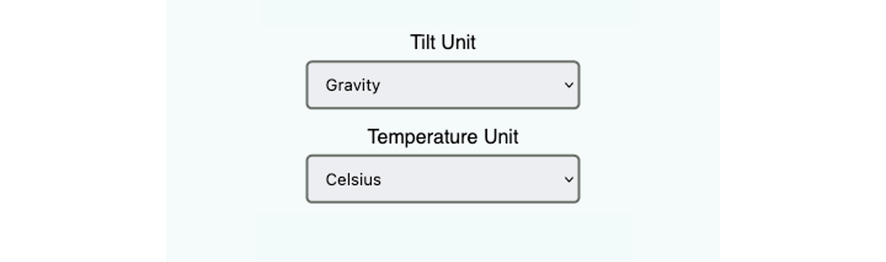

# Customize units


**Precondiion:**\
To make this setting you must have access to the user interface. If this is not the case, see here how to do it:[access-to-the-user-interface.md](access-to-the-user-interface.md "mention")


## Step 1: Open the Menue

To access the menu bar you have to click on the three lines in the upper left corner. (See arrow)\
Then the menu bar will open.

## Step 2: Select "Settings"

On this page, you can adjust various settings to personalize your experience with the device. Options you can customize include the interval at which the device collects and sends data, the units displayed on the main page, and the overhead detection feature. You can also enable temperature compensation to ensure accurate measurements. Take some time to explore the various settings available and make the necessary adjustments for your needs.

## Step 3: Change Unit

### Temperature

* **Celsius** The unit Celsius (°C) is the international standard temperature scale used for measuring temperatures, with zero set at 0 °C and the boiling point of water set at 100 °C.
* **Fahrenheit** Fahrenheit (°F) is a temperature scale used in the United States and some other countries, with the freezing point of water set at 32 °F and the boiling point at 212 °F.
* **Kelvin**. The unit Kelvin (K) is a temperature scale used in science and industrial applications and on which the absolute temperature scale is based. On the Kelvin scale, absolute zero is set at 0 K, which corresponds to the theoretical state of complete immobility of atoms and molecules. The Kelvin scale is often used in physics and chemistry because it is independent of the type of heat transfer and has no negative values.


The set units do not affect the services.

This means that the data sent will always be consistent, no matter what unit is set.


### Save Settings

Saving the data is important because it is the only way to connect to the service after waking up from DeepSleep.

You can check whether the saving was successful by looking at the settings file at http://TempTrack001/settings.json/. to check if the save was successful. This file is the permanent memory of the TempTrack.

A second way to check the saving is to reload the page (all browsers offer this). If the properties are then reloaded, the TempTrack has accepted them, otherwise the old settings are reloaded.
