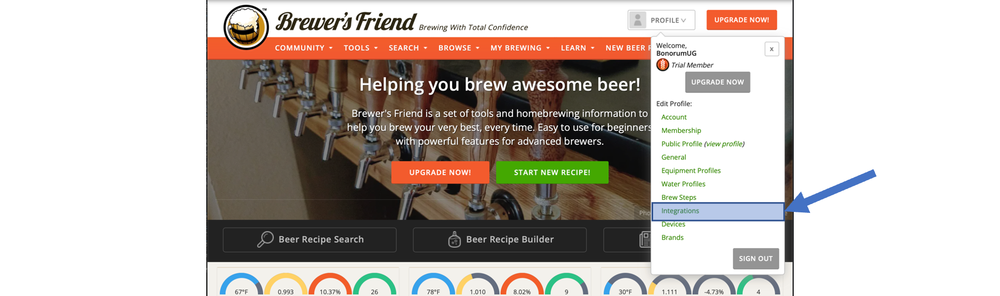
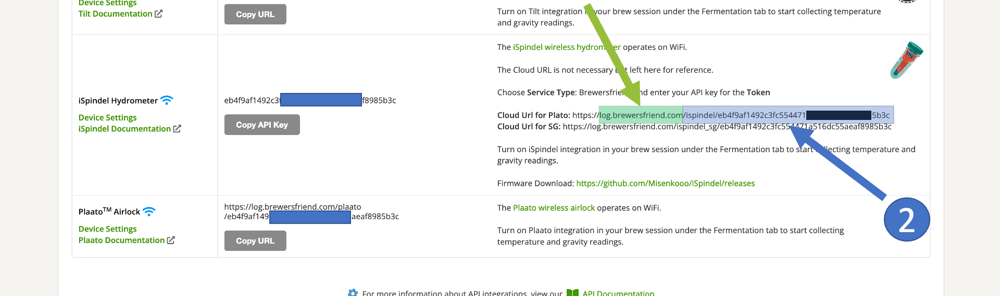
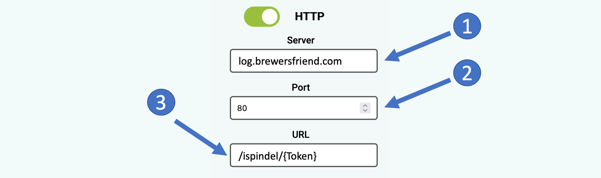
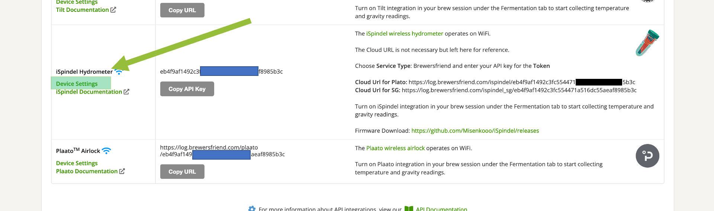
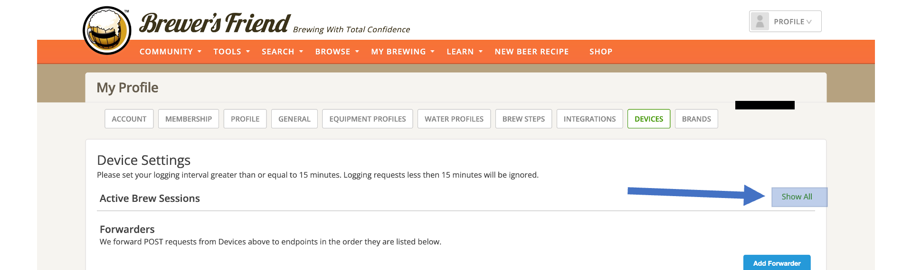
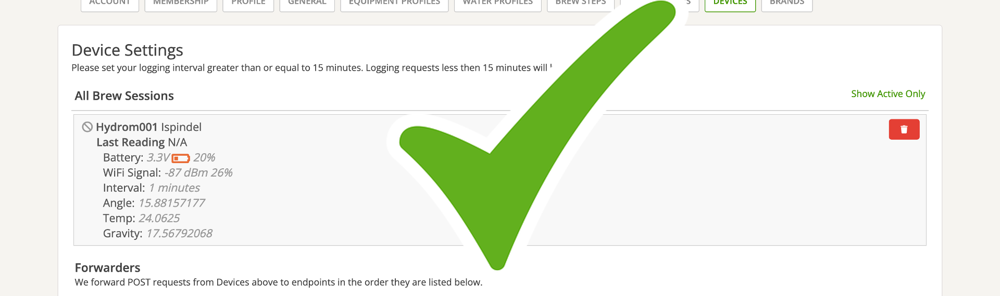

# Connect the Hydrom to Brewers Friend

Diesen Anleitung ist auch auf Deutsch verfügbar: [Link](https://anleitung.hydrom.io)


**Prerequisite:**

1. **Access to user interface**\
   To make this setting, you must have access to the user interface. If this is not the case, see here how to do it:[access-to-the-user-interface.md](access-to-the-user-interface.md "mention")
2. **Brewer´s Friend user account available**\
   An account has been created with Brewer's Friend. The test account is not sufficient to connect the hydrom. Please upgrade the trial account\
   https://www.brewersfriend.com


## Add the hydrom to Brewers Friend

Log in to Brewer's Friend

### Navigate to the Devicemanager

Under the profile there is a menu "Integrations". All compatible devices are listed here.

### Copy the token

The Hydrom is not yet natively supported, so you have to take the detour via the iSpindle interface.\
Here we are interested in the address of the server (1) and the token (2).\
\
Copy the token, you will need it in the next few steps.

## Configuring the Hydrom

## Step 1: Open the Menue

To access the menu bar you have to click on the three lines in the upper left corner. (See arrow)\
Then the menu bar will open.

## Step 2: Select "Service"

The "Services" page is a resource that allows users to select and configure various interfaces and cloud services for use with their system. On this page, users can choose from three different interfaces - HTTP, MQTT, and TCP - and several cloud services, and then activate and parameterize these options to suit their needs. This page is a useful tool for those who want to connect their system to the cloud or other external services and customize the way in which data is transmitted and received. With the options available on the "Services" page, users can tailor their system to meet their specific requirements and ensure that it is able to communicate effectively with other devices and systems.

### Activate http-client and change the settings

On the "Service" page, the http-Server service must be activated.

<figure><figcaption></figcaption></figure>

**1: Server Address:** Insert "log.brewersfriend.com" here.

**2: Server Port:** Insert "80" here.

**3: URL:** here "/ispindel/" must be entered. and behind it the token of the Brewers Friend Service. For example "/ispindel/eb4f9af1492c3fc554471eb4f9af1492c3fc554471".

### Check if the Testmessage arrived

If a test message has been sent from the hydrom, as described below, then it is possible to check whether the service has also received the message.

On the integrations page, click on "Device Settings" as shown in the following picture:

<figure><figcaption></figcaption></figure>

And then you can click on "Show all" as shown in the following picture:

<figure><figcaption></figcaption></figure>

If then this message appears, then you have done it. Just put it to sleep and then you are ready to go.

<figure><figcaption></figcaption></figure>

### additional settings

In order not to consume too much power, we would turn Bluetooth off when it is not needed. It was documented here:


[add-bluetooth.md](../add-bluetooth.md)


In order for the Hydrom to transmit the data reliably, a DeepSleep time must be set. This is documented on this page:


[enable-deepsleep.md](../other-settings/enable-deepsleep.md)


### Save Settings

Saving the data is important because it is the only way to connect to the service after waking up from DeepSleep.

You can check whether the saving was successful by looking at the settings file at http://hydrom001/settings.json/. to check if the save was successful. This file is the permanent memory of the Hydrom.

A second way to check the saving is to reload the page (all modern browsers offer this Feature). If the properties are then reloaded, the hydrom has accepted them, otherwise the old settings are reloaded.

### Send Test-message

By activating this button, you can check whether the Hydrom has a connection to the service and to the individual parts of the service. If you now click on "Save", the set services are executed once and the page is reloaded. On the new page you can see whether the servers are accessible and the ports are open.

### activate DeepSleep

Activating DeepSleep is mandatory for the hydrom to be able to send data. If DeepSleep is activated, the hydrom wakes up after the set time and sends the data to the set service. Afterwards, the hydrom goes back to sleep and waits for the new service.


[enable-deepsleep.md](../other-settings/enable-deepsleep.md)



To ensure that the device sends measured values to the Service in the set interval as intended, the Hydrom must be put into deep sleep.

There are two ways to put the Hydrom into deep sleep.

Turning the _**power switch off and on**_ is the easiest way to put the Hydrom into deep sleep.

The alternative way is to put it to sleep _**via the UI**_. To do this, open the navigation bar and go to the "DeepSleep" tab.

